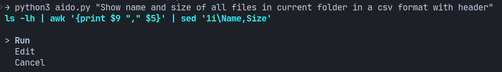

# aido

Implementation of a (toy) command called `aido` (A.I. Do, like... sudo - Super User Do) that receives an input in natural language and converts it into a valid Linux (Ubuntu, in this case) command using the OpenAI API.



The prompt can be written in Brazilian Portuguese as well, to better suit your preferences!

## Setup

Install dependencies:

```
pip3 install -r requirements.txt
```

This script uses the OpenAI API. Therefore, you should create an OpenAI API account, obtain an API key, and set that key as an environment variable before executing it. To get your API key, access https://platform.openai.com/account/api-keys and set it in the environment using:

```
export OPENAI_API_KEY=<your-api-key>
```

## Use

Execute with python:

```
python3 aido.py <Your prompt>
```

Replace `<Your prompt>` with the natural language input that you want to convert into a Linux command. For example:

```
python3 aido.py "Exibir o conteúdo do arquivo texto.txt"
```

This will convert the input "Exibir o conteúdo do arquivo texto.txt" into a valid Linux command using the OpenAI API.
